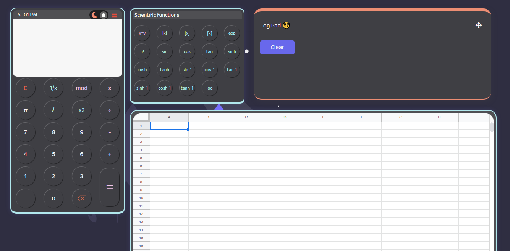

# Battle of Calcus :tada:
> HTML - CSS - JS

> Add me on facebook: 
[https://www.facebook.com/stfurtrd](https://www.facebook.com/stfurtrd)

> Follow me on Instagram: 
[https://www.instagram.com/real_vals_28/](https://www.instagram.com/real_vals_28/)

> Follow me on Twitter: 
[https://twitter.com/kent_sevillejo](https://twitter.com/kent_sevillejo)

#### Note: This site is ideal only for those who have a screen size greater than 1280px !
## The view for screens less than 1366px

## The view for screens above 1366px

> Goal
- [x] Simplicity
- [x] Functionality
- [x] Ease-of-access

> Features
- [x] Basic Operations
- [x] Scientific Functions
- [x] Log Pad
- [x] Night Mode & Day Mode
- [x] Google Spreadsheet

> Challenge from Programming Philippines Group
[Programming Philippines](https://www.facebook.com/groups/649943542157470/)

