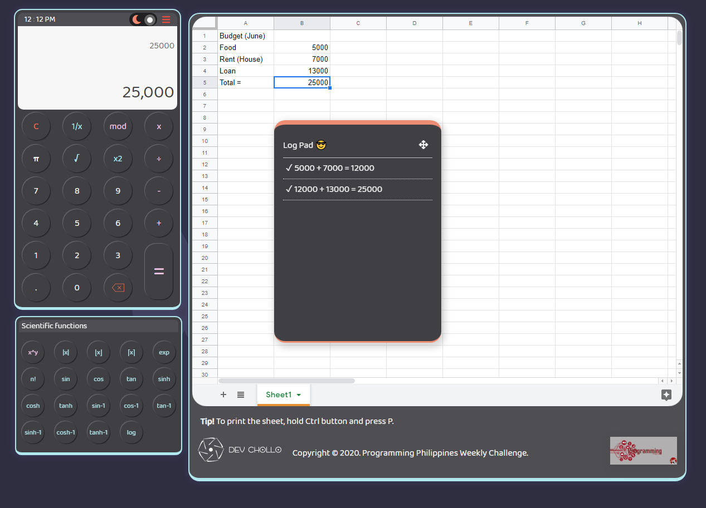

# Battle of Calcus :tada:
> HTML - CSS - JS 

```javascript
let do = (calculator === 'Awesome') ? github.Star() : github.Fork().then(improve);
```

> Add me on facebook: :blue_heart:
[https://www.facebook.com/stfurtrd](https://www.facebook.com/stfurtrd)

> Follow me on Instagram: :green_heart:
[https://www.instagram.com/real_vals_28/](https://www.instagram.com/real_vals_28/)

> Follow me on Twitter: :purple_heart:
[https://twitter.com/kent_sevillejo](https://twitter.com/kent_sevillejo)

#### Note: This site is ideal only for those who have a screen size greater than 1280px !
## The view for screens less than 1366px wide


## The view for screens above 1366px wide


> Goal
- [x] Simplicity
- [x] Functionality
- [x] Ease-of-access

> Features
- [x] Basic Operations
- [x] Scientific Functions
- [x] Log Pad
- [x] Night Mode & Day Mode
- [x] Google Spreadsheet

> Updates and Bug fix
- [x] Added Clear button for the Log Pad
- [x] Auto scroll to bottom in the Log Pad feature added
- [x] Bug fixed for the logpad still showing result without input
- [x] Bug fixed for the current operand reset 
- [x] Bug fixed for the log pad still showing the pressed number even if its deleted


> If bug is found, please contact me thru my facebook messenger thankyouu :heartpulse:


> Challenge from Programming Philippines Group
[Programming Philippines](https://www.facebook.com/groups/649943542157470/)


